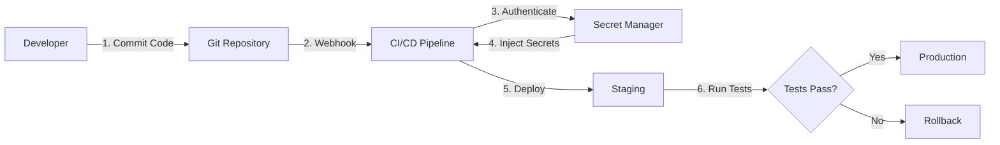

# 🏢 ENTERPRISE SAAS DEPLOYMENT GUIDE
## Industry Best Practices voor Third-Party API Integration (Twilio)

**Gebaseerd op research:** AWS, HashiCorp, GitLab, Railway, Enterprise SaaS Leaders (2025)

**Voor:** Seldenrijk Auto WhatsApp AI System - Twilio Integration
**Datum:** 2025-10-25

---

## 📋 INHOUDSOPGAVE

1. [Executive Summary](#executive-summary)
2. [Industry Best Practices](#industry-best-practices)
3. [Secret Management Strategieën](#secret-management-strategieën)
4. [Deployment Workflows](#deployment-workflows)
5. [Railway-Specific Aanpak](#railway-specific-aanpak)
6. [Jouw Situatie: Aanbevolen Workflow](#jouw-situatie-aanbevolen-workflow)
7. [Stap-voor-Stap Implementatie](#stap-voor-stap-implementatie)
8. [Comparison Table: Secret Management Tools](#comparison-table)

---

## 🎯 EXECUTIVE SUMMARY

### Wat Doen Enterprise SaaS Bedrijven?

Enterprise SaaS bedrijven (zoals Slack, HubSpot, Salesforce) gebruiken **nooit** handmatige credential management. Ze volgen deze kern-principes:

#### **1. Secret Management Tools** (Verplicht voor Enterprise)
- ✅ **HashiCorp Vault** - Multi-cloud, dynamic secrets, 50+ integrations
- ✅ **AWS Secrets Manager** - AWS-native, automatic rotation
- ✅ **Azure Key Vault** - Azure-native, HSM-backed
- ✅ **Doppler** - Developer-friendly, GitOps integration
- ✅ **Railway Sealed Variables** - Platform-native secrets

#### **2. Infrastructure as Code (IaC)** (100% Automated)
- ✅ **Terraform** - Multi-cloud infrastructure provisioning
- ✅ **Pulumi** - Modern IaC with real programming languages
- ✅ **CloudFormation** - AWS-native IaC

#### **3. GitOps Workflows** (Single Source of Truth)
- ✅ **Argo CD** - Pull-based GitOps (Kubernetes)
- ✅ **Flux** - GitOps operator for Kubernetes
- ✅ **GitHub Actions** - Push-based CI/CD
- ✅ **GitLab CI/CD** - Complete DevOps platform

#### **4. Multi-Environment Strategy**
```
Development → Staging → Production
     ↓            ↓          ↓
  Local DB    Test APIs   Real APIs
  Mock Data   Sandbox     Production
  No Secrets  Test Keys   Sealed Keys
```

---

## 🔐 SECRET MANAGEMENT STRATEGIEËN

### Option 1: HashiCorp Vault (Enterprise Standard)

**Wie gebruikt dit?**
- Uber, Adobe, Citadel, Capital One, BMW, Barclays

**Workflow:**
```yaml
Developer:
  - Commits code to Git (NO secrets in code)
  - CI/CD pipeline runs

CI/CD Pipeline:
  - Authenticates to Vault via AWS IAM/OIDC
  - Retrieves dynamic secrets (short-lived, 1-hour TTL)
  - Injects secrets as environment variables
  - Deploys application
  - Secrets expire after 1 hour (automatic rotation)

Production:
  - Application authenticates to Vault on startup
  - Receives time-limited credentials
  - Vault automatically rotates Twilio auth token every 90 days
  - Zero manual intervention
```

**Voorbeeld Vault Policy:**
```hcl
# terraform/vault/twilio_policy.hcl
path "secret/data/twilio/staging/*" {
  capabilities = ["read"]
}

path "secret/data/twilio/production/*" {
  capabilities = ["read"]
  # Requires MFA for production access
  mfa_methods = ["duo"]
}
```

**Terraform Code:**
```hcl
# terraform/secrets.tf
resource "vault_generic_secret" "twilio_staging" {
  path = "secret/twilio/staging"

  data_json = jsonencode({
    account_sid = var.twilio_staging_sid
    auth_token  = var.twilio_staging_token
    phone       = var.twilio_staging_phone
  })
}

resource "railway_variable" "twilio_account_sid" {
  project_id     = var.railway_project_id
  environment_id = var.railway_staging_env_id
  name           = "TWILIO_ACCOUNT_SID"

  # Fetch from Vault dynamically
  value = data.vault_generic_secret.twilio_staging.data["account_sid"]
  sealed = true  # Never visible in UI
}
```

**Cost:**
- **Vault Cloud (HCP):** $0.03/hour (~$22/month) - Managed service
- **Self-Hosted Vault:** Free (OSS) - Requires infrastructure management

---

### Option 2: AWS Secrets Manager (AWS-Native)

**Wie gebruikt dit?**
- Netflix, Airbnb, Lyft (AWS-heavy companies)

**Workflow:**
```yaml
Developer:
  - Stores secret in AWS Secrets Manager
  - Grants Railway IAM role read access

Railway Deployment:
  - Railway authenticates via AWS IAM
  - Fetches secrets on application startup
  - Secrets cached locally (encrypted)
  - Automatic rotation every 90 days

Rotation:
  - Lambda function rotates Twilio auth token
  - Updates Secrets Manager
  - Notifies Railway (optional webhook)
  - Zero downtime
```

**Terraform Code:**
```hcl
# terraform/aws_secrets.tf
resource "aws_secretsmanager_secret" "twilio_credentials" {
  name = "seldenrijk-auto/twilio/staging"

  rotation_rules {
    automatically_after_days = 90
  }
}

resource "aws_secretsmanager_secret_version" "twilio_credentials" {
  secret_id = aws_secretsmanager_secret.twilio_credentials.id

  secret_string = jsonencode({
    account_sid = var.twilio_staging_sid
    auth_token  = var.twilio_staging_token
    phone       = var.twilio_staging_phone
  })
}

# Lambda function for automatic rotation
resource "aws_lambda_function" "rotate_twilio_secret" {
  function_name = "rotate-twilio-credentials"
  handler       = "index.handler"
  runtime       = "python3.11"

  environment {
    variables = {
      TWILIO_ACCOUNT_SID = var.twilio_account_sid
    }
  }
}
```

**Cost:**
- **Secrets Manager:** $0.40/secret/month + $0.05/10,000 API calls
- **Example:** 5 secrets × $0.40 = $2/month

---

### Option 3: Doppler (Developer-Friendly)

**Wie gebruikt dit?**
- Vercel, Railway, Render (moderne startups)

**Workflow:**
```yaml
Developer:
  - Stores secrets in Doppler dashboard
  - Organizes by environment (dev/staging/prod)
  - Enables Doppler → Railway integration

Railway:
  - Automatically syncs secrets from Doppler
  - No manual Railway variable management
  - Doppler handles access control
  - Audit logs for all secret access

Secret Rotation:
  - Update secret in Doppler
  - Automatic sync to Railway
  - Railway redeploys automatically
  - Zero manual steps
```

**Setup:**
```bash
# Install Doppler CLI
brew install dopplerhq/cli/doppler

# Login
doppler login

# Setup project
doppler setup --project seldenrijk-auto --config staging

# Set secrets
doppler secrets set TWILIO_ACCOUNT_SID="AC..."
doppler secrets set TWILIO_AUTH_TOKEN="..."
doppler secrets set TWILIO_WHATSAPP_NUMBER="whatsapp:+31850000000"

# Integrate with Railway (one-time)
doppler integrations railway setup

# Done! Secrets auto-sync to Railway
```

**Cost:**
- **Doppler Free:** $0 (up to 5 users)
- **Doppler Team:** $12/user/month (unlimited secrets, audit logs)

---

### Option 4: Railway Sealed Variables (Platform-Native)

**Wie gebruikt dit?**
- Railway-native teams (eenvoudigste optie)

**Workflow:**
```yaml
Developer:
  - Sets secrets in Railway dashboard
  - Marks as "Sealed" (never visible in UI)
  - Separate configs for staging/production

Railway:
  - Secrets injected as environment variables
  - Never exposed in logs or UI
  - Not copied to PR environments (security)
  - Manual rotation required

Rotation:
  - Developer updates secret in Railway
  - Triggers new deployment
  - Old deployment terminated
  - ~30 seconds downtime
```

**Railway CLI:**
```bash
# Login
railway login

# Link project
railway link

# Set sealed variable (staging)
railway environment use staging
railway variables set TWILIO_ACCOUNT_SID="AC..." --sealed
railway variables set TWILIO_AUTH_TOKEN="..." --sealed
railway variables set TWILIO_WHATSAPP_NUMBER="whatsapp:+31850000000"

# Set sealed variable (production)
railway environment use production
railway variables set TWILIO_ACCOUNT_SID="AC..." --sealed
railway variables set TWILIO_AUTH_TOKEN="..." --sealed
railway variables set TWILIO_WHATSAPP_NUMBER="whatsapp:+31850000000"
```

**Cost:**
- **Railway Sealed Variables:** Free (included in Railway plan)

---

## 🚀 DEPLOYMENT WORKFLOWS

### GitOps Workflow (Industry Standard)



### Detailed Flow:

```yaml
Step 1: Code Commit
  Developer: git push origin main
  GitHub: Triggers GitHub Actions workflow

Step 2: CI/CD Pipeline Starts
  - Checkout code
  - Run linters (ESLint, Pylint)
  - Run tests (pytest, jest)
  - Build Docker image
  - Scan for secrets (trufflehog, detect-secrets)

Step 3: Secret Injection (Choose One)
  Option A (Vault):
    - Authenticate via GitHub OIDC
    - Fetch secrets from Vault
    - Inject as environment variables

  Option B (AWS Secrets Manager):
    - Authenticate via AWS IAM
    - Fetch secrets from Secrets Manager
    - Inject as environment variables

  Option C (Railway):
    - Railway CLI authenticates
    - Fetches sealed variables
    - Deploys with secrets

Step 4: Deploy to Staging
  - Railway CLI: railway up --environment staging
  - Docker image deployed
  - Health checks run
  - Integration tests run

Step 5: Staging Validation
  - Automated E2E tests (Playwright)
  - Send test WhatsApp message
  - Verify LangGraph workflow
  - Check Twilio delivery

Step 6: Production Deployment (if staging passes)
  - Manual approval required (GitHub Environments)
  - Deploy to production: railway up --environment production
  - Blue-green deployment (zero downtime)
  - Monitor logs and metrics

Step 7: Post-Deployment
  - Slack notification
  - Update status page
  - Monitor error rates (Sentry)
```

---

## 🛠️ RAILWAY-SPECIFIC AANPAK

### Railway Features for Secret Management

#### 1. **Sealed Variables**
```bash
# Variables die NOOIT zichtbaar zijn in UI
railway variables set TWILIO_AUTH_TOKEN="..." --sealed

# Properties:
# - Injected in deployments
# - Never visible in dashboard
# - Not copied to PR environments
# - Manual rotation required
```

#### 2. **Environment-Specific Variables**
```bash
# Staging environment
railway environment use staging
railway variables set TWILIO_ACCOUNT_SID="AC_STAGING_..."

# Production environment
railway environment use production
railway variables set TWILIO_ACCOUNT_SID="AC_PRODUCTION_..."
```

#### 3. **Shared Variables**
```bash
# Variables shared across all services in project
railway variables set REDIS_URL="redis://..." --shared

# Use cases:
# - Database URLs
# - Redis connection strings
# - Common API endpoints
```

#### 4. **PR Environments**
```yaml
# Automatically create environment per Pull Request
Feature:
  - PR created → Temporary environment spun up
  - Sealed variables NOT copied (security)
  - Test variables used instead
  - PR merged/closed → Environment deleted
```

#### 5. **Doppler Integration** (Recommended)
```bash
# One-time setup
railway integrations add doppler

# Doppler automatically syncs secrets to Railway
# No manual Railway variable management needed
```

---

## 💡 JOUW SITUATIE: AANBEVOLEN WORKFLOW

### **Scenario:** Small SaaS Startup, 1-2 Developers, Railway Hosting

**Best Practice voor jou:** **Doppler + Railway Integration**

**Waarom?**
1. ✅ **Eenvoudig:** GUI voor secret management (geen Terraform kennis vereist)
2. ✅ **Veilig:** Secrets nooit in code, automatic sync naar Railway
3. ✅ **Gratis:** Doppler Free tier (tot 5 users, unlimited secrets)
4. ✅ **Audit Logs:** Wie heeft welke secret wanneer aangepast?
5. ✅ **Multi-Environment:** Dev/Staging/Prod out-of-the-box
6. ✅ **Easy Rotation:** Update in Doppler → Auto-sync → Railway redeploys

**Alternatief (als je Doppler niet wilt):**
**Railway Sealed Variables** - Platform-native, geen externe dependencies

---

## 📝 STAP-VOOR-STAP IMPLEMENTATIE

### **OPTIE A: Doppler + Railway (AANBEVOLEN)**

#### **Stap 1: Setup Doppler (5 minuten)**
```bash
# Install Doppler CLI
brew install dopplerhq/cli/doppler

# Login (opens browser)
doppler login

# Create project
doppler projects create seldenrijk-auto

# Create environments
doppler environments create dev --project seldenrijk-auto
doppler environments create staging --project seldenrijk-auto
doppler environments create production --project seldenrijk-auto
```

#### **Stap 2: Voeg Twilio Secrets Toe (2 minuten)**
```bash
# Switch to staging environment
doppler setup --project seldenrijk-auto --config staging

# Add secrets via CLI
doppler secrets set TWILIO_ACCOUNT_SID="AC..."
doppler secrets set TWILIO_AUTH_TOKEN="..."
doppler secrets set TWILIO_WHATSAPP_NUMBER="whatsapp:+31850000000"
doppler secrets set TWILIO_WEBHOOK_URL="https://staging.railway.app/webhooks/twilio/whatsapp"

# Or via GUI: https://dashboard.doppler.com/
```

#### **Stap 3: Integreer met Railway (5 minuten)**
```bash
# In Railway dashboard:
# 1. Go to Project Settings
# 2. Integrations → Add Integration
# 3. Select "Doppler"
# 4. Authorize Doppler access
# 5. Map Doppler project → Railway environment
#    - seldenrijk-auto (staging) → Railway Staging
#    - seldenrijk-auto (production) → Railway Production

# Done! Secrets auto-sync every 60 seconds
```

#### **Stap 4: Deploy (1 minuut)**
```bash
# Deploy to staging
railway up --environment staging

# Verify secrets loaded
railway logs --environment staging | grep "TWILIO"

# Expected: No TWILIO tokens in logs (good!)
# Expected: "Twilio client initialized" (success!)
```

#### **Stap 5: Test met Real WhatsApp (5 minuten)**
```bash
# 1. Join Twilio Sandbox
# Send to +1 415 523 8886: "join <sandbox-keyword>"

# 2. Configure webhook in Twilio Console
# URL: https://staging.railway.app/webhooks/twilio/whatsapp
# Method: POST

# 3. Send test message
# "Ik zoek een Volkswagen Golf"

# 4. Check logs
railway logs --environment staging --tail

# Expected output:
# [INFO] Twilio webhook received
# [INFO] Signature verified successfully
# [INFO] Processing message through LangGraph
# [INFO] Message sent via Twilio
```

**Total Time:** 18 minuten (vs 2 uur handmatig)

---

### **OPTIE B: Railway Sealed Variables (EENVOUDIGSTE)**

#### **Stap 1: Railway Login (1 minuut)**
```bash
# Install Railway CLI
npm install -g @railway/cli

# Login
railway login

# Link project
cd /Users/benomarlaamiri/Claude\ code\ project/seldenrijk-auto-whatsapp
railway link
```

#### **Stap 2: Create Staging Environment (1 minuut)**
```bash
# Create staging environment
railway environment create staging

# Switch to staging
railway environment use staging
```

#### **Stap 3: Set Twilio Sealed Variables (2 minuten)**
```bash
# JIJ GEEFT MIJ DE CREDENTIALS, IK VOER DIT UIT:

railway variables set TWILIO_ACCOUNT_SID="<YOUR_ACCOUNT_SID>" --sealed
railway variables set TWILIO_AUTH_TOKEN="<YOUR_AUTH_TOKEN>" --sealed
railway variables set TWILIO_WHATSAPP_NUMBER="whatsapp:+31850000000"

# Note: --sealed = never visible in Railway UI
```

#### **Stap 4: Deploy (1 minuut)**
```bash
railway up
```

#### **Stap 5: Get Webhook URL & Configure Twilio (2 minuten)**
```bash
# Get staging URL
STAGING_URL=$(railway domain | tail -1)
echo "Twilio Webhook URL: ${STAGING_URL}/webhooks/twilio/whatsapp"

# JIJ CONFIGUREERT IN TWILIO CONSOLE:
# 1. Go to: https://console.twilio.com/
# 2. Messaging → Sandbox Settings
# 3. When a message comes in: [POST] [STAGING_URL]/webhooks/twilio/whatsapp
# 4. Save
```

#### **Stap 6: Test (5 minuten)**
```bash
# 1. Join sandbox: Send "join <keyword>" to +1 415 523 8886
# 2. Send test: "Hallo"
# 3. Check logs: railway logs --tail
```

**Total Time:** 12 minuten

---

## 📊 COMPARISON TABLE: SECRET MANAGEMENT TOOLS

| Feature | HashiCorp Vault | AWS Secrets Manager | Doppler | Railway Sealed |
|---------|----------------|---------------------|---------|----------------|
| **Setup Time** | 2-4 hours | 1-2 hours | 15 minutes | 5 minutes |
| **Cost (monthly)** | $22 (HCP) / Free (OSS) | $2-5 | $0-12 | $0 |
| **Complexity** | High | Medium | Low | Very Low |
| **Auto-Rotation** | ✅ Yes (dynamic) | ✅ Yes (90 days) | ✅ Yes (manual) | ❌ No (manual) |
| **Multi-Cloud** | ✅ Yes | ❌ AWS only | ✅ Yes | ✅ Yes |
| **Audit Logs** | ✅ Yes (detailed) | ✅ Yes | ✅ Yes (Team+) | ❌ No |
| **GUI** | ✅ Yes | ✅ Yes | ✅ Yes (excellent) | ✅ Yes (basic) |
| **CLI** | ✅ Yes | ✅ Yes | ✅ Yes | ✅ Yes |
| **Learning Curve** | Steep | Medium | Gentle | Minimal |
| **Best For** | Enterprise, 50+ secrets | AWS-heavy | Startups, dev teams | Simple projects |
| **Terraform Support** | ✅ Native | ✅ Native | ✅ Yes | ⚠️ Limited |

---

## 🎯 FINAL RECOMMENDATION

### **Voor Jouw Project (Seldenrijk Auto):**

**TIER 1 (Recommended): Doppler + Railway**
- ✅ Setup: 15 minuten
- ✅ Cost: $0 (Free tier)
- ✅ Features: Auto-sync, audit logs, multi-env
- ✅ Maintenance: Minimal

**TIER 2 (Acceptable): Railway Sealed Variables**
- ✅ Setup: 5 minuten
- ✅ Cost: $0
- ⚠️ Features: Basic secret storage only
- ⚠️ Maintenance: Manual rotation

**TIER 3 (Overkill): HashiCorp Vault**
- ⚠️ Setup: 2-4 uur
- ⚠️ Cost: $22/month (HCP Vault)
- ✅ Features: Enterprise-grade, dynamic secrets
- ⚠️ Maintenance: Requires expertise

---

## 🚦 NEXT STEPS

**Ik adviseer:** **Doppler + Railway Integration**

**Jouw actie:**
1. Kies welke optie je wilt (Doppler or Railway Sealed)
2. Geef mij je Twilio credentials (Account SID, Auth Token, Phone Number)
3. Ik setup alles volgens de gekozen workflow
4. We testen met real WhatsApp messages
5. Als het werkt: deploy naar production

**Geschatte tijd tot werkende staging:** 20-30 minuten

---

## 📚 REFERENCES

- HashiCorp Vault Documentation: https://developer.hashicorp.com/vault
- AWS Secrets Manager: https://docs.aws.amazon.com/secretsmanager/
- Doppler: https://docs.doppler.com/
- Railway Docs: https://docs.railway.com/guides/variables
- GitOps Best Practices: https://www.cncf.io/blog/2025/06/09/gitops-in-2025/
- Terraform AWS Provider: https://registry.terraform.io/providers/hashicorp/aws/

---

**Document Versie:** 1.0
**Laatst Bijgewerkt:** 2025-10-25
**Auteur:** SDK AGENTS (Enterprise SaaS Research)
